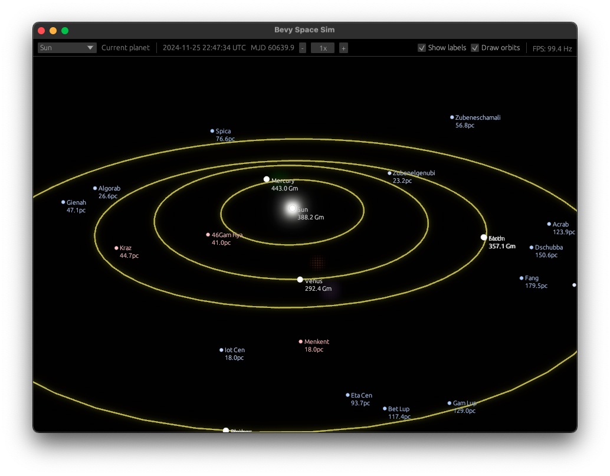

# Bevy Spacesim



## Description

This project is a space simulation application built using the Bevy game engine, along with the `big_space` and `egui`
libraries.

## Known issues

- Orbit lines are misaligned with their respective bodies.
- No textures
- Requires extra `#[reflect(Component)]` attributes on `big_space`, which I have done in a local patch not published.  
  As such, the simulation is not in a valid state by default; you need to add. See "Patching `big_space`" below.

## Compilation and Running

To compile and run the project, use the standard Rust procedures. Ensure you have `cargo` installed.

1. Clone the repository:
    ```sh
    git clone https://github.com/solarliner/bevy-spacesim
    cd bevy-spacesim
    ```

2. Build the project:
    ```sh
    cargo build --features dev
    ```

3. Run the project:
    ```sh
    cargo run --features dev
    ```

## Credits

This project uses data from the [HYG Database](https://github.com/astronexus/HYG-Database). We extend our gratitude to
the creators.

## License

This project is licensed under the MIT License. See the `LICENSE` file for details.

## Patching `big_space`

The following patch can be applied on top of `big_space`'s `main` branch:

```diff
diff --git a/src/floating_origins.rs b/src/floating_origins.rs
--- a/src/floating_origins.rs	(revision b2ebb025e7410adaaec73e6db497f1ea48eb0c4e)
+++ b/src/floating_origins.rs	(date 1732294061721)
@@ -12,6 +12,7 @@
 /// [`BigSpace`] will be computed relative to this floating origin. There should always be exactly
 /// one entity marked with this component within a [`BigSpace`].
 #[derive(Component, Reflect)]
+#[reflect(Component)]
 pub struct FloatingOrigin;
 
 /// A "big space" is a hierarchy of high precision reference frames, rendered with a floating
@@ -27,6 +28,7 @@
 /// [`GlobalTransform`](bevy_transform::components::GlobalTransform) of all spatial entities within
 /// that `BigSpace`.
 #[derive(Debug, Default, Component, Reflect)]
+#[reflect(Component)]
 pub struct BigSpace {
     /// Set the entity to use as the floating origin within this high precision hierarchy.
     pub floating_origin: Option<Entity>,
diff --git a/src/reference_frame/mod.rs b/src/reference_frame/mod.rs
--- a/src/reference_frame/mod.rs	(revision b2ebb025e7410adaaec73e6db497f1ea48eb0c4e)
+++ b/src/reference_frame/mod.rs	(date 1731954347507)
@@ -34,6 +34,7 @@
 /// the same rotating reference frame, instead of moving rapidly through space around a star, or
 /// worse, around the center of the galaxy.
 #[derive(Debug, Clone, Reflect, Component)]
+#[reflect(Component)]
 pub struct ReferenceFrame<P: GridPrecision + Reflect> {
     /// The high-precision position of the floating origin's current grid cell local to this
     /// reference frame.
```